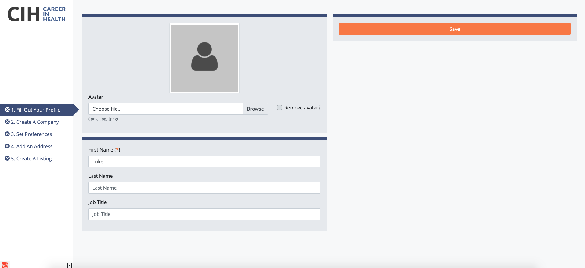
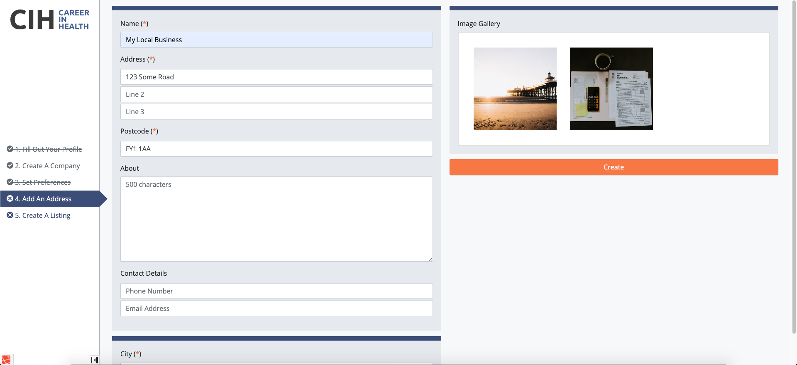
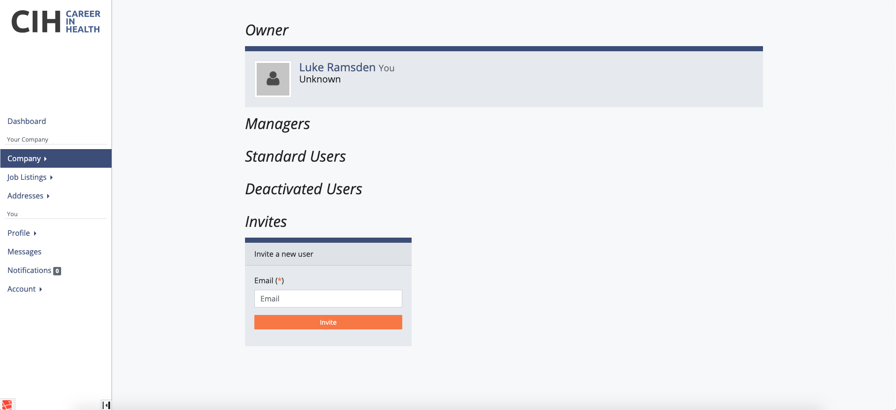
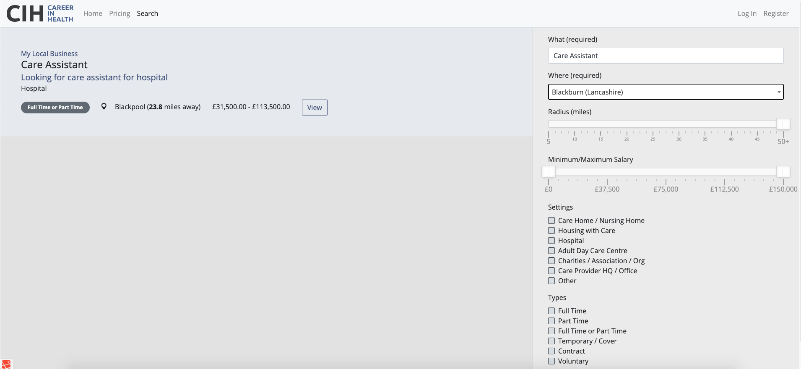
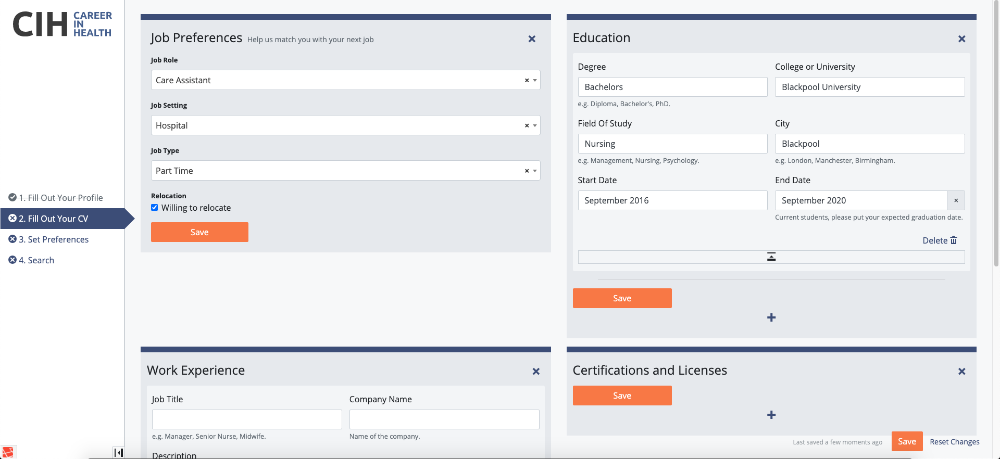
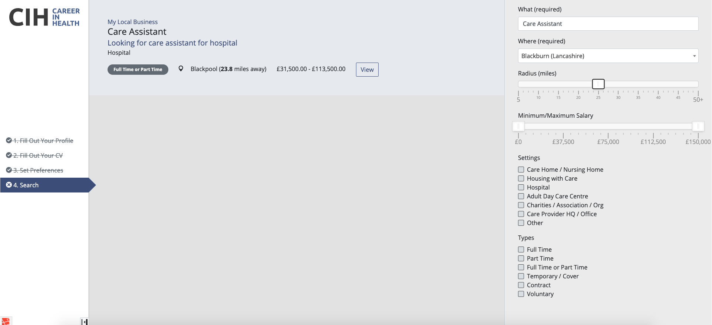
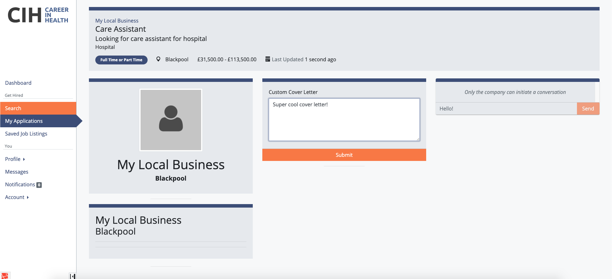
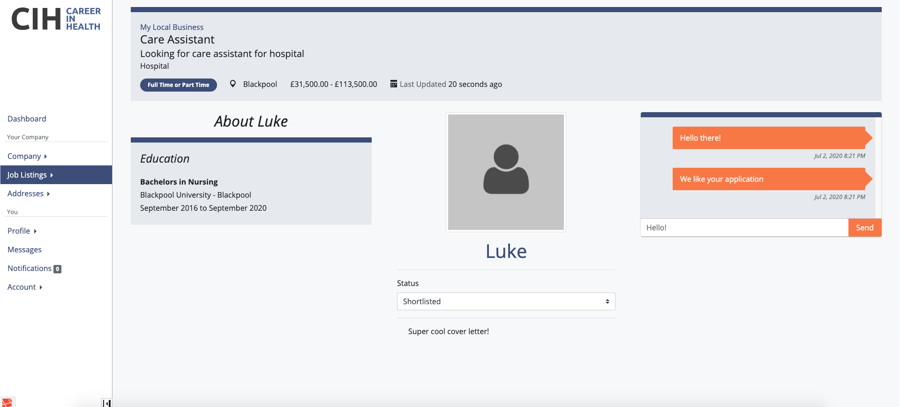
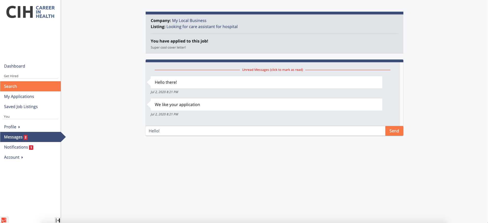

Web application I implemented during a ~10 month work experience - also my first time using PHP/Laravel.

---












--

### Installation
#### Dependencies
- PHP 7.1.3+
- Node 8+ (and npm)
- MariaDB
- Redis 3

#### Set-up Commands
```bash
composer install
php artisan symlink
sudo cp vendor/h4cc/wkhtmltopdf-amd64/bin/wkhtmltopdf-amd64 /usr/local/bin/
sudo chmod +x /usr/local/bin/wkhtmltopdf-amd64

npm i
npm run prod
npm i -g pm2 laravel-echo-server

pm2 startup # Makes sure to setup the startup script properly, pm2 should tell you what to do

laravel-echo-server init
### LARAVEL ECHO SERVER SETTINGS
# Development mode : No
# Port             : default (6001)
# Database         : redis
#
# Choose HTTPS for the next 2 only if SSL is set up for this server/domain
# Host       : http(s)://careerinhealth.co.uk
# Http/Https : http(s)
#
# IMPORTANT: set ECHO_APP_ID and ECHO_APP_KEY in .env to what is generated next
# Generate id/key     : Yes
# Cross-domain access : No
###

cp .env.example .env
vim .env # config to match environment

php artisan migrate

pm2 start echo.json
pm2 start artisan --name laravel-worker --interpreter php -- queue:work --daemon
pm2 save
```

#### Cron Jobs
```
* * * * * php /path-to-application/artisan schedule:run >> /dev/null 2>&1
```
